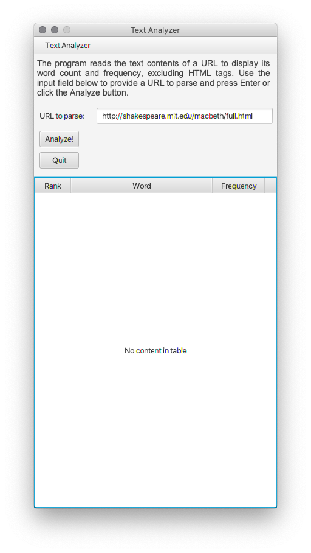
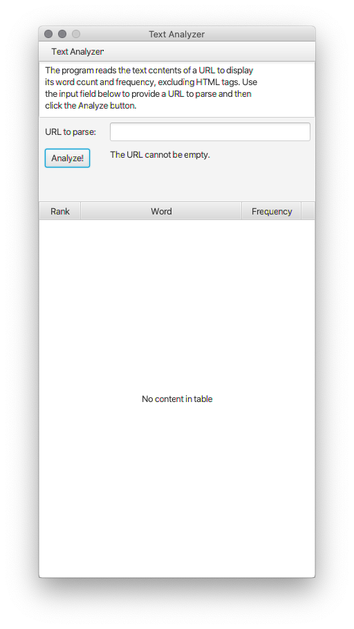
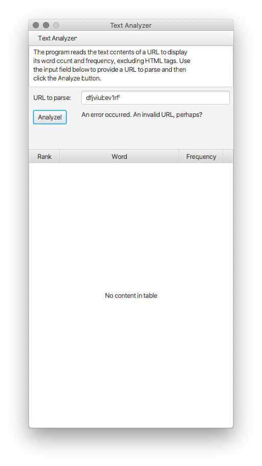
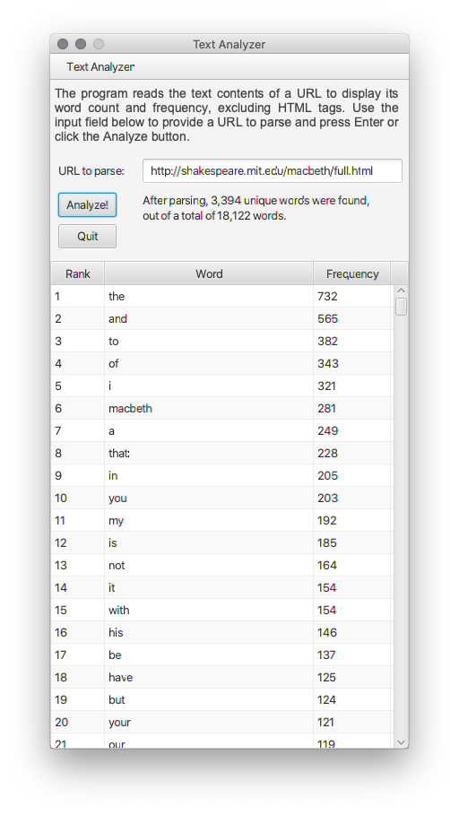
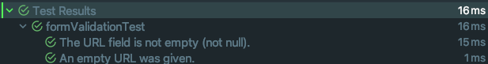
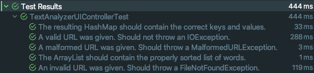

# TextAnalyzer

## Overview
This exercise uses a GUI (Graphical User Interface) that allows a user to specify a URL (Uniform Resource Locator or website address) from which the file will be read and displays statistics about the words in that file, excluding HTML (HyperText Markup Language) tags.

## What does this program do?
The program reads the text contents of a URL and will use specific filters to strip the HTML tags and punctuation from the file. It will then output the word frequencies of all words in the file, sorted by the most frequently used words. The output shows a set of pairs, each pair containing a word and how many times it occurred in the file, ordered by frequency in descending order.

## Code design
The original version of the program was contained in a single class and output was made exclusively to the console. The source file URL was hardcoded, meaning that the user had no way to choose what file to parse, unless the user knew their way around the code to change the target URL in the source code. The current version of the program uses JavaFX to present a GUI that allows the user to enter the URL of the file they wish to parse.

## Test plans and standards
The program was not originally developed using TDD (Test Driven Development) standards. In other words, no unit tests were used to test the code or expected output. Testing was done incrementally, that is, after each minor complete change, typically after each line of code was added, mainly to catch compile-time and runtime errors not previously caught and highlighted by the IDE.

The current version (1.7) of the program now includes unit tests created using Junit.

## System requirements
The program in its current version is a JavaFX application, using version 8 of Amazon's distribution of the Open Java Development Kit (OpenJDK) [Corretto 8](https://aws.amazon.com/corretto/), which includes JavaFX 8. Unit tests were performed using [Junit 5](https://github.com/junit-team/junit5/).

## How to use this program.
The program requires no user interaction other than compilation and execution. The GUI is made up of a single stage (window) and a single scene (window content). The scene presents the user with an input field to specify the URL of the file they wish to parse. The results will be displayed in a TableVIew.

After the results are displayed, the user can enter another URL for analysis.

## Installation.
To install the program, simply clone the repo, open it in your favorite IDE, and run it. Make sure that Java JDK 8 and JavaFX 8 are installed in your system. 

## Known Issues
Not all HTML files are created equal. The program's code to convert HTML files to plain text is still rudimentary, as it is unable to identify HTML tag properties in lines without opening or closing tags.

For example, in the following code:

```html
<div class="Popover anim-scale-in js-tagsearch-popover"
     hidden
     data-tagsearch-url="/qstainless/TextAnalyzer/find-symbols"
     data-tagsearch-ref="master"
     data-tagsearch-path="README.md"
     data-tagsearch-lang="Markdown">
</div>
```

The following will be considered as 'words' by the program because the lines do not begin with "<" nor end with ">".

```html
     hidden
     data-tagsearch-url="/qstainless/TextAnalyzer/find-symbols"
     data-tagsearch-ref="master"
     data-tagsearch-path="README.md"
```

This is because the program parses the target URL line by line. Lines that begin with "<" or end with ">" are ignored for purposes of counting words in them.

## To do
Refactor the `countWordFrequencies` method to detect lines that begin with "<" and ignore all following lines up to and including the next line with a closing ">". Because the lines will be ignored, there will be no need to call the `htmlToText`. 

## Screenshots
### Initial prompt

### Empty URL

### Invalid URL

### Results


## Unit Tests
### formValidation Class

### TextAnalyzerUIController Class

