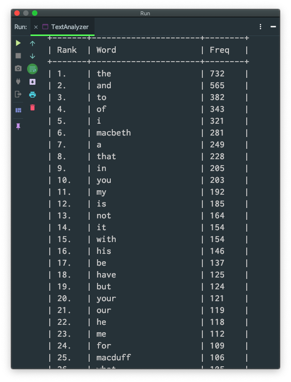

# TextAnalyzer
Reads a file from a URL and outputs statistics about that file.

Outputs the word frequencies of all words in the file, sorted by the most frequently used word. 
The output shows a set of pairs, each pair containing a word and how many times it occurred in the file, ordered by
frequency in descending order.

Console output:

