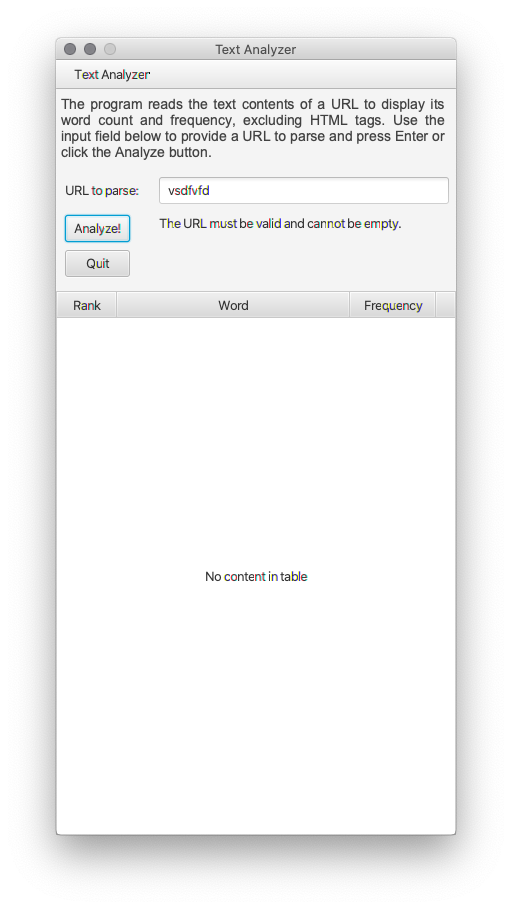
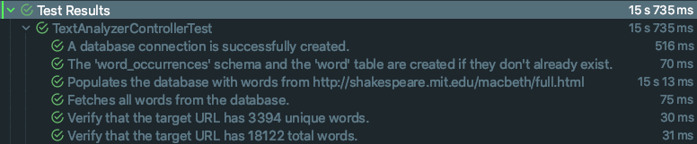

# TextAnalyzer
Go to [TextAnalyzer Server](https://github.com/qstainless/TextAnalyzerServer) or [TextAnalyzer Client](https://github.com/qstainless/TextAnalyzerClient).

## Overview
This exercise uses a GUI (Graphical User Interface) that allows a user to specify a URL (Uniform Resource Locator or website address) from which a file will be read and displays statistics about the words in that file, excluding HTML (HyperText Markup Language) tags. 

## What does this program do?
The program reads the text contents of a URL and will use specific filters to strip the HTML tags and punctuation from the file (see [Known Issues](#known-issues)). It will then store all unique words and their frequencies into a MySQL database. Next, the program will read the word/frequency pairs from the database to finally display them in the GUI, ordered by word frequency in descending order. 

## Code design
The original version of the program was contained in a single class, and output was made exclusively to the console. The source file URL was hardcoded, meaning that the user had no way to choose what file to parse unless the user knew their way around the code to change the target URL in the source code. The current version of the program uses JavaFX to present a GUI that allows the user to enter the URL of the file they wish to parse. 

Adding database support introduced a unique challenge to this exercise. Creating a separate Database class was probably not a good idea. The Database class should only be responsible for creating the database connection and performing queries. However, in doing so, I ran into the issue of creating too many database connections, and the program would exit prematurely.  

The issue happened only when attempting to add the words parsed from the target URL into the database. For each token (word) found, the program would query the database to see if the word existed. If so, its frequency counter would increase by one, and the database updated accordingly. If not, the program inserts a new row with the new word and its frequency set to one. For every word found, the program would open at least two database connections, one for querying the database and another to either update an existing record or insert a new one. After only a few words, the number of allowed connections is exceeded. 

To solve this issue, I moved the `storeWordsIntoDatabase` method to the Database class to keep it simple.  

The program could have included a more comprehensive database implementation, including the use of a ConnectionPool and full CRUD functionality. Considering the limited scope of the program and the fact that it does not expect nor require user input to manipulate the database, I felt that such implementation was unnecessary. 

As it is, the `storeWordsIntoDatabase` method uses a single database connection for the entire parsing process and storage of the word/frequency pairs. The program uses only four additional database connections to create the schema and table if they don't already exist, query the total number of words parsed, the total number of unique words found, and the word/frequency pairs to populate the TableView. 

## Test plans and standards
The program was not developed initially using TDD (Test Driven Development) standards. In other words, the code and expected output were not tested formally. Testing was done incrementally, that is, after each completed minor change, typically after each line of code was added, mainly to catch compile-time and runtime errors not previously detected and highlighted by the IDE. 

As of version 1.7, the program includes unit tests created using Junit.

## System requirements
The program is a JavaFX application using version 8 of Amazon's distribution of the Open Java Development Kit (OpenJDK) [Corretto 8](https://aws.amazon.com/corretto/), which includes JavaFX 8. Unit tests were created using [Junit 5](https://github.com/junit-team/junit5/).

## Database connection defaults
The program assumes that an existing database user with all database privileges in the local MySQL database with username/password: textanalyzer/textanalyzer. It also assumes that it will connect to localhost using default port 3306. However, the user may change these initial configuration options by editing lines 32 to 35 in the `Database` class: 

```
/src/gce/textanalyzer/controller/Database.java

32    String databaseHost = "localhost";
33    String databasePort = "3306";
34    String databaseUser = "textanalyzer";
35    String databasePass = "textanalyzer";
```

## How to use this program.
The program requires no user interaction other than compilation and execution. However, the user must first create a local MySQL user for the program to interact with the database (see [System Requirements](#system-requirements)). 

The GUI consists of a single stage (window) and a single scene (window content). Although the scene's input field is pre-populated with the exercise's target URL, the user may specify the URL of a different file to parse. The results will appear in the TableVIew.

After the results are displayed, the user may enter the URL of another file for analysis.

## Installation.
To install the program, simply clone the repo, open it in your favorite IDE, and run it. Make sure that Java JDK 8 and JavaFX 8 are installed in your system. 

## Known Issues
Not all HTML files are created equal. The program's code to convert HTML files to plain text is still rudimentary, as it is unable to identify HTML tag properties in lines without opening or closing tags.

For example, in the following code:

```html
<div class="Popover anim-scale-in js-tagsearch-popover"
     hidden
     data-tagsearch-url="/qstainless/TextAnalyzer/find-symbols"
     data-tagsearch-ref="master"
     data-tagsearch-path="README.md"
     data-tagsearch-lang="Markdown">
</div>
```

The following will be considered as 'words' by the program because the lines do not begin with "<" nor end with ">."

```html
     hidden
     data-tagsearch-url="/qstainless/TextAnalyzer/find-symbols"
     data-tagsearch-ref="master"
     data-tagsearch-path="README.md"
```

That is because the program parses the target URL line by line. Lines that begin with "<" or end with ">" are ignored for purposes of counting words in them. 

## Todo
Refactor the `countWordFrequencies` method to detect lines that begin with "<" and ignore all following lines up to and including the next line with a closing ">." Because the parser will ignore the lines, there will be no need to call the `htmlToText` method.

## Version history
The version numbering of this project does not follow most version numbering guidelines. Instead, it is limited to a two-token concept:

```(major).(course module)``` 

```
Version 1.10 (current) - Added database support
Version 1.9 - Added JavaDocs
Version 1.7 - Added unit tests using JUnit
Version 1.6 - Added GUI functionality
Version 1.2 - First version
```

## Screenshots
### Initial prompt

### Empty URL

### Invalid URL

### Results


## Unit Tests
### formValidation Class

### TextAnalyzerUIController Class

